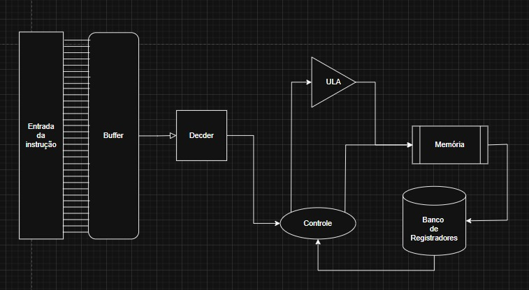

<h1 align="center">Coprocessador aritmético especializado em operações matriciais</h1>

<h2>Descrição do Projeto</h2>

  Para a elaboração do projeto, foi utilizado o kit de desenvolvimento DE1-SoC com o processador Cyclone V, permitindo a leitura e escrita de dados diretamente na memória RAM do dispositivo. O objetivo do programa é implementar um coprocessador dedicado ao processamento de matrizes quadradas, variando de 2x2 até 5x5. As operações com matrizes são fundamentais no contexto computacional, pois estão presentes em diversas aplicações, como processamento de imagens, criptografia, telecomunicações, entre outras. Dessa forma, este repositório pode ser utilizado como base para projetos que envolvam esses tipos de aplicações. 

  O coprocessador é capaz de lidar com as seguintes operações:

  * Soma
  * Subtração
  * Multiplição
  * Multiplicação escalar
  * Determinante
  * Transposição de matriz
  * Matriz oposta

Sumário
=================
<!--ts-->
   * [Caminho de Dados](#caminho-de-dados)
   * [Arquitetura do Conjunto de Instruções](#instrucao)
   * [Máquina de Estados](#maquina-de-estados)
      * [FETCH](#fetch)
      * [DECODE](#decode)
      * [EXECUTE](#execute)
      * [MEMORY](#memory)
   * [Unidade Lógica e Aritmética (ULA)](#ula)
   * [Testes](#testes) 
   * [Resultados](#resultados)
   * [Referências](#referencias)
<!--te-->

  <h2>Caminho de Dados</h2>
  

    O caminho de dados é uma unidade funcional dentro de um processador que executa operações de processamento de dados usando componentes como unidades lógicas aritméticas, barramentos, multiplexadores e     registradores. É responsável por executar instruções e manipular dados no processador. O diagrama do caminho de dados do projeto é mostrado logo abaixo:
  

     
    
  

  

  

  <h2>Arquitetura do Conjunto de Instruções</h2>
   

    A ISA (Arquitetura do Conjunto de Instruções) define as instruções que o processador reconhece e executa, incluindo operações, tipos de dados e modos de endereçamento. Neste projeto, o tamanho da instrução é de 32 bits, entretanto desses 32 utilizamos 28 bits para instrução, organizados respectivamente da seguinte maneira:
  

  <table border="1" align="center">
    <tr>
        <td>Número 0</td>
        <td>Número 1</td>
        <td>Identificador</td>
        <td>Linha</td>
        <td>Coluna</td>
        <td>Opcode</td>
    </tr>
    <tr>
      <td>8 bits</td>
      <td>8 bits</td>
      <td>2 bits</td>
      <td>3 bits</td>
      <td>3 bits</td>
      <td>4 bits</td>
    </tr>
  </table>
  

    O Número 0 e o Número 1 são os números enviados para matriz, logo é possível perceber que a cada instrução são encaminhados dois números por vez. 
  

   

    O identificador indica ao coprocessador qual matriz está sendo utilizada na operação, conforme a tabela a seguir:
  

  <table border="1" align="center">
    <tr>
      <td>Matriz A</td>
      <td>Matriz B</td>
      <td>Matriz C</td>
    </tr>
    <tr>
      <td>00</td>
      <td>01</td>
      <td>10</td>
    </tr>
  </table>
  

   A linha e a coluna são utilizadas para identificar a posição específica da matriz que está sendo acessada durante a operação. No entanto, como cada instrução armazena dois valores simultaneamente, só é possível inserir elementos de 2 em 2. Ou seja, ao adicionar um elemento na posição [0][0], o programa automaticamente insere também um segundo elemento na posição seguinte, [0][1].
  Dessa forma, para adicionar um número, por exemplo, na posição [0][3], é necessário inserir os dois elementos a partir da posição imediatamente anterior, ou seja, em [0][2]. O primeiro valor será armazenado em [0][2] e o segundo, em [0][3].
  Essa lógica pode ser visualizada mais claramente na tabela a seguir:
  

  <table border="1" align="center">
    <tr>
      <td>Linha</td>
      <td>Coluna</td>
      <td>Posição da Matriz</td>
    </tr>
    <tr><td>000</td><td>000</td><td>[0][0] e [0][1]</td></tr>
    <tr><td>000</td><td>001</td><td>Não é possível acessar</td></tr>
    <tr><td>000</td><td>010</td><td>[0][2] e [0][3]</td></tr>
    <tr><td>000</td><td>011</td><td>Não é possível acessar</td></tr>
    <tr><td>000</td><td>100</td><td>[0][4] e [0][5]</td></tr>
  </table>
  

    O opcode é para indicar ao programa qual função ele deve executar, de forma que a LEITURA e a ESCRITA são operações feitas na memória enquanto as outras são referentes a operações aritméticas, nesse projeto ele possui os seguintes comandos:    
  

  <table border="1" align="center">
    <tr>
      <td>LEITURA</td>
      <td>ESCRITA</td>
      <td>SOMA</td>
      <td>SUBTRAÇÃO</td>
      <td>MULTIPLICAÇÃO</td>
      <td>TRANSPOSTA</td>
      <td>OPOSTA</td>
      <td>MULTIPLICAÇÃO ESCALAR</td>
      <td>MATRIZ DETERMINANTE 2X2</td>
      <td>MATRIZ DETERMINANTE 3X3</td>
      <td>MATRIZ DETERMINANTE 4X4</td>
      <td>MATRIZ DETERMINANTE 5X5</td>
    </tr>
    <tr>
      <td>0001</td>
      <td>0010</td>
      <td>0011</td>
      <td>0100</td>
      <td>0101</td>
      <td>0110</td>
      <td>0111</td>
      <td>1000</td>
      <td>1001</td>
      <td>1010</td>
      <td>1011</td>
      <td>1100</td>
    </tr>
  </table>

  <h2>Máquina de Estados</h2>
  Na arquitetura de uma unidade de processamento central (CPU) é utilizado o ciclo Fetch-Decode-Execute (FDE) para executar instruções, nesse modelo o processador tem três estados, busca, decodificação e execução, dessa forma foi utilizado esse modelo no projeto com a adição do estado MEMORY para lidar com todas operações feitas com a memória. 

   
  

  
   
  O módulo responsável nesse desenvolvimento é o <code>top.v</code>
  

  <h2>Estado de FETCH</h2>
  
  

  <h2>Estado de DECODE</h2>
  
  

  <h2>Estado de MEMORY</h2>
  
  

  <h2>Estado de EXECUTE</h2>
  
  

  

  <h2>Unidade Lógica e Aritmética (ULA)</h2>
  

  A ULA (Unidade Lógica e Aritmética) desempenha um papel essencial na execução de diversas operações matemáticas e lógicas com dígitos binários, que são os elementos fundamentais da informática. Ela é crucial não apenas para cálculos simples, mas também para decisões internas realizadas pela unidade central de processamento (CPU).

  No desenvolvimento do projeto, a ULA recebe duas matrizes, um opcode e um sinal de start. As instruções referentes às operações estão descritas no tópico <code>Arquitetura do Conjunto de Instruções</code>.
  

  

  Para a operação de determinante, é fundamental analisar e distinguir corretamente o tamanho da matriz. Isso porque, diferentemente de outras operações, que são projetadas para lidar com o tamanho máximo previsto permitindo que, mesmo que uma matriz menor seja enviada, o resultado ainda seja correto , no caso do cálculo do determinante, utilizar uma matriz com tamanho inferior ao esperado pode resultar em um valor incorreto. A seguir, será descrito o funcionamento de cada operação em detalhe.
  <h4>OPERAÇÃO DE SOMA</h4> 
  
      

