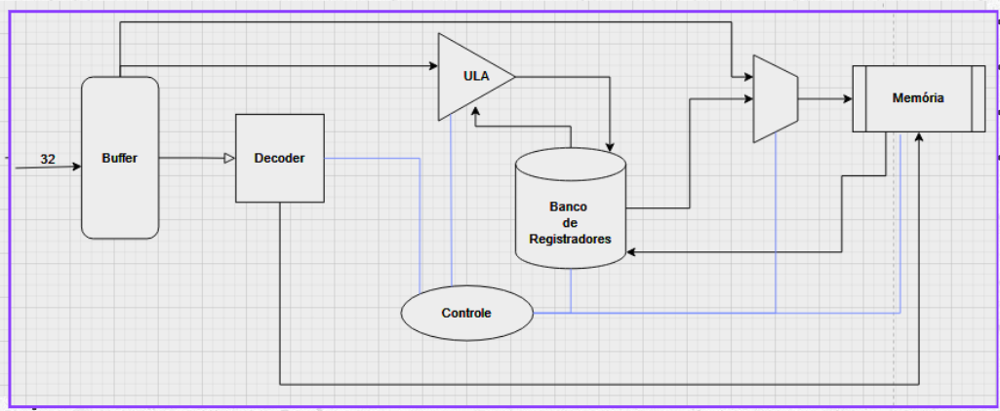
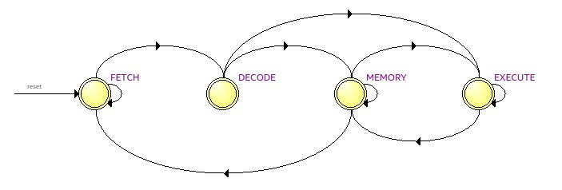
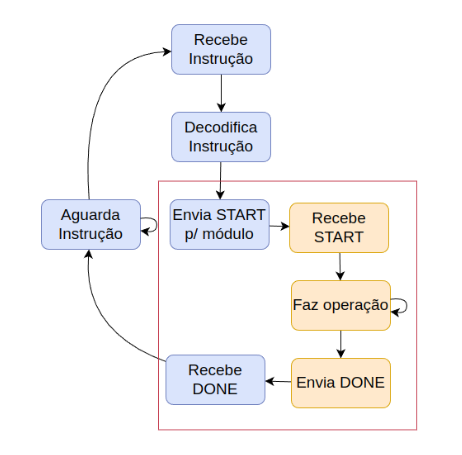
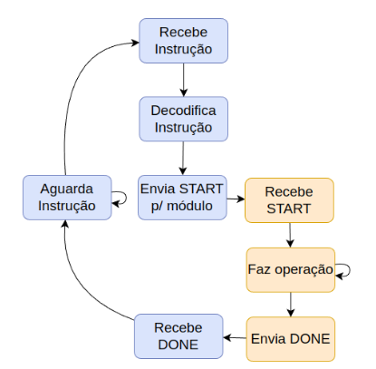
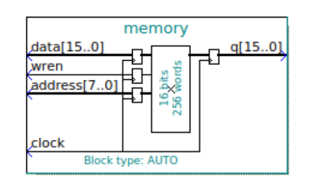
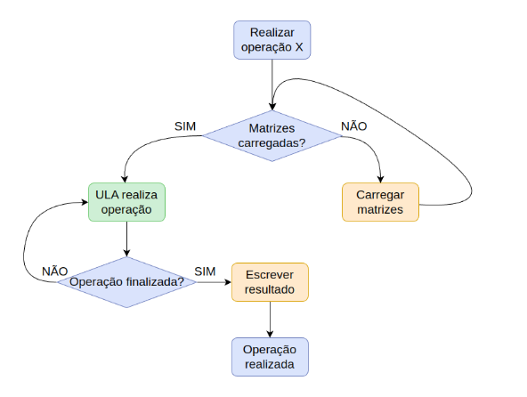

<h1 align="center">Coprocessador aritmético especializado em operações matriciais</h1>

<h2>Descrição do Projeto</h2>

  Para a elaboração do projeto, foi utilizado o kit de desenvolvimento DE1-SoC com o processador Cyclone V, permitindo a leitura e escrita de dados diretamente na memória RAM do dispositivo. O objetivo do programa é implementar um coprocessador dedicado ao processamento de matrizes quadradas, variando de 2x2 até 5x5. As operações com matrizes são fundamentais no contexto computacional, pois estão presentes em diversas aplicações, como processamento de imagens, criptografia, telecomunicações, entre outras. Dessa forma, este repositório pode ser utilizado como base para projetos que envolvam esses tipos de aplicações. 

  

    
  

  
  O coprocessador é capaz de lidar com as seguintes operações:

  * Soma
  * Subtração
  * Multiplição
  * Multiplicação escalar
  * Determinante
  * Transposição de matriz
  * Matriz oposta

Sumário
=================
<!--ts-->
   * [Caminho de Dados](#caminho-de-dados)
   * [Arquitetura do Conjunto de Instruções](#instrucao)
   * [Máquina de Estados](#maquina-de-estados)
      * [FETCH](#fetch)
      * [DECODE](#decode)
      * [EXECUTE](#execute)
      * [MEMORY](#memory)
   * [Unidade Lógica e Aritmética (ULA)](#ula)
      * [SOMA](#soma)
      * [SUBTRACAO](#subtracao)
      * [TRANSPOSTA](#transposta)
      * [OPOSTA](#oposta)
      * [MULTIPLICAÇÃO ESCALAR](#escalar)
      * [MULTIPLICACAO](#multiplicacao)
      * [DETERMINANTE 2X2](#deter2x2)
      * [DETERMINANTE 3X3](#deter3x3)
      * [DETERMINANTE 4X4](#deter4x4)
      * [DETERMINANTE 5x5](#deter5x5)
   * [Testes](#testes) 
   * [Referências](#referencias)
<!--te-->

  <h2>Caminho de Dados</h2>
  

    O caminho de dados é uma unidade funcional dentro de um processador que executa operações de processamento de dados usando componentes como unidades lógicas aritméticas, barramentos, multiplexadores e     registradores. É responsável por executar instruções e manipular dados no processador. O diagrama do caminho de dados do projeto é mostrado logo abaixo:
  

     
    

      
    

  

  

  

  <h2>Arquitetura do Conjunto de Instruções</h2>
   

    A ISA (Arquitetura do Conjunto de Instruções) define as instruções que o processador reconhece e executa, incluindo operações, tipos de dados e modos de endereçamento. Neste projeto, o tamanho da instrução é de 32 bits, entretanto desses 32 utilizamos 28 bits para instrução, organizados respectivamente da seguinte maneira:
  

  <table border="1" align="center">
    <tr>
        <td>Número 0</td>
        <td>Número 1</td>
        <td>Identificador</td>
        <td>Linha</td>
        <td>Coluna</td>
        <td>Opcode</td>
    </tr>
    <tr>
      <td>8 bits</td>
      <td>8 bits</td>
      <td>2 bits</td>
      <td>3 bits</td>
      <td>3 bits</td>
      <td>4 bits</td>
    </tr>
  </table>
  

    O Número 0 e o Número 1 são os números enviados para matriz, logo é possível perceber que a cada instrução são encaminhados dois números por vez. 
  

   

    O identificador indica ao coprocessador qual matriz está sendo utilizada na operação, conforme a tabela a seguir:
  

  <table border="1" align="center">
    <tr>
      <td>Matriz A</td>
      <td>Matriz B</td>
      <td>Matriz C</td>
    </tr>
    <tr>
      <td>00</td>
      <td>01</td>
      <td>10</td>
    </tr>
  </table>
  

   A linha e a coluna são utilizadas para identificar a posição específica da matriz que está sendo acessada durante a operação. No entanto, como cada instrução armazena dois valores simultaneamente, só é possível inserir elementos de 2 em 2. Ou seja, ao adicionar um elemento na posição [0][0], o programa automaticamente insere também um segundo elemento na posição seguinte, [0][1].
  Dessa forma, para adicionar um número, por exemplo, na posição [0][3], é necessário inserir os dois elementos a partir da posição imediatamente anterior, ou seja, em [0][2]. O primeiro valor será armazenado em [0][2] e o segundo, em [0][3].
  Essa lógica pode ser visualizada mais claramente na tabela a seguir:
  

  <table border="1" align="center">
    <tr>
      <td>Linha</td>
      <td>Coluna</td>
      <td>Posição da Matriz</td>
    </tr>
    <tr><td>000</td><td>000</td><td>[0][0] e [0][1]</td></tr>
    <tr><td>000</td><td>001</td><td>Não é possível acessar</td></tr>
    <tr><td>000</td><td>010</td><td>[0][2] e [0][3]</td></tr>
    <tr><td>000</td><td>011</td><td>Não é possível acessar</td></tr>
    <tr><td>000</td><td>100</td><td>[0][4] e [1][0]</td></tr>
  </table>
  

    O opcode é para indicar ao programa qual função ele deve executar, de forma que a LEITURA e a ESCRITA são operações feitas na memória enquanto as outras são referentes a operações aritméticas, nesse projeto ele possui os seguintes comandos:    
  

  <table border="1" align="center">
    <tr>
      <td>LEITURA</td>
      <td>ESCRITA</td>
      <td>SOMA</td>
      <td>SUBTRAÇÃO</td>
      <td>MULTIPLICAÇÃO</td>
      <td>TRANSPOSTA</td>
      <td>OPOSTA</td>
      <td>MULTIPLICAÇÃO ESCALAR</td>
      <td>MATRIZ DETERMINANTE 2X2</td>
      <td>MATRIZ DETERMINANTE 3X3</td>
      <td>MATRIZ DETERMINANTE 4X4</td>
      <td>MATRIZ DETERMINANTE 5X5</td>
    </tr>
    <tr>
      <td>0001</td>
      <td>0010</td>
      <td>0011</td>
      <td>0100</td>
      <td>0101</td>
      <td>0110</td>
      <td>0111</td>
      <td>1000</td>
      <td>1001</td>
      <td>1010</td>
      <td>1011</td>
      <td>1100</td>
    </tr>
  </table>

  <h2>Máquina de Estados</h2>
  Na arquitetura de uma unidade de processamento central (CPU) é utilizado o ciclo Fetch-Decode-Execute (FDE) para executar instruções, nesse modelo o processador tem três estados, busca, decodificação e execução, dessa forma foi utilizado esse modelo no projeto com a adição do estado MEMORY para lidar com todas operações feitas com a memória. 

   
  

  
   
  O módulo responsável nesse desenvolvimento é o <code>top.v</code>
  

  <h2>Estado de FETCH</h2>
  No estado de fetch, o processador inicia o ciclo de execução buscando a próxima instrução que deve ser executada. A instrução é recebida via barramento de dados, ao receber o sinal de <code>activate instructor</code>.

   

    
  

Uma vez que a instrução é lida da memória, ela é transferida para o registrador de instrução, conhecido como IR (Instruction Register). Esse registrador serve como um local temporário para armazenar a instrução enquanto o processador se prepara para decodificá-la e executá-la nos próximos estados do ciclo.

Após carregar a instrução no IR, o processador incrementa o valor do PC para que ele aponte para a próxima instrução na memória. Esse incremento depende do tamanho das instruções na arquitetura em questão, no caso desse reporsitório é utilizado instruções de 4 bytes, assim o PC é incrementado em 4 unidades. Com isso, o estado de fetch termina e o processador está pronto para passar ao estado de decodificação da instrução.

  <h2>Estado de DECODE</h2>
  No estado de decode, o processador interpreta a instrução que foi buscada durante o estado de fetch. Essa instrução já está armazenada no registrador de instrução (IR), e agora precisa ser analisada para que o processador entenda qual operação deve ser realizada, quais registradores estão envolvidos e, se necessário, quais dados adicionais precisarão ser acessados. Durante a decodificação, a unidade de controle do processador lê os bits da instrução e os divide em campos específicos, nesse caso dois números, identificador, linha, coluna e opcode. Com base nesses campos, o processador entende, por exemplo, se deve realizar uma operação aritmética entre matrizes, carregar ou ler um valor da memória.

   

    
  

  
Nesse estado, também ocorre a preparação para a execução. Além disso, a unidade de controle configura os sinais necessários para que os próximos estágios do ciclo funcionem corretamente, como habilitar a unidade aritmética, preparar acesso à memória ou configurar os caminhos de dados dentro da CPU. Assim, o estado de decode é essencial para traduzir a instrução binária em ações concretas que o processador pode executar. Ele prepara todos os componentes internos do processador para que a próxima etapa, a execução, aconteça de forma correta e eficiente.

  <h2>Estado de MEMORY</h2>
  O estado de MEMORY possui dois tipos de acesso, explícito e implícito. O explícito é para operações de leitura e escrita na memória, enquanto o implícito é para operações aritméticas realizadas na memória.

   

    
  

 Esse estado só é ativado quando a instrução decodificada requer interação com a memória principal, como no caso de carregar um valor de um endereço específico para um registrador, ou armazenar um valor de um registrador em um determinado endereço da memória.Ele é importante porque separa claramente as operações de acesso à memória do restante do ciclo de instrução, o que facilita o controle e evita conflitos no uso dos barramentos e da lógica interna do processador, assim garante que leitura e escrita sejam feitas de forma organizada e segura, respeitando o tempo necessário para que a memória responda corretamente a essas operações.
  

  <h2>Estado de EXECUTE</h2>
  O estado de execute, nesse projeto, é responsável por realizar operações aritméticas com matrizes, como soma, subtração e multiplicação. Ele só é iniciado após a conclusão do estado de memory, que garante que as matrizes envolvidas na operação tenham sido corretamente carregadas da memória principal para os registradores internos do processador.

   

    
  

Quando o estado de execute é ativado, as matrizes já estão disponíveis, e a ULA (Unidade Lógica e Aritmética) começa a operar sobre elas de acordo com o tipo de instrução que foi decodificada anteriormente. Por exemplo, se a instrução indica uma soma de matrizes, os elementos correspondentes de cada matriz são somados posição a posição. No caso de uma multiplicação, o processador realiza a operação linha por coluna, seguindo as regras padrão da multiplicação matricial.

Esse estado é responsável por coordenar o uso da unidade de processamento para garantir que todas as operações entre as matrizes ocorram corretamente, lidando com os índices, o armazenamento temporário de resultados parciais, e o controle do fluxo entre os elementos. Ao final do estado de execute, a matriz resultante da operação está pronta para ser armazenada de volta na memória, caso a instrução exija, o que será feito no próximo estado.

Assim, o estado de execute é o núcleo do processamento matemático do sistema, sendo acionado apenas quando os dados estão carregados e prontos, garantindo eficiência e organização na execução das operações com matrizes.
  

  

  <h2>Unidade Lógica e Aritmética (ULA)</h2>
  

  A ULA (Unidade Lógica e Aritmética) desempenha um papel essencial na execução de diversas operações matemáticas e lógicas com dígitos binários, que são os elementos fundamentais da informática. Ela é crucial não apenas para cálculos simples, mas também para decisões internas realizadas pela unidade central de processamento (CPU).

  No desenvolvimento do projeto, a ULA recebe duas matrizes, um opcode e um sinal de start. As instruções referentes às operações estão descritas no tópico <code>Arquitetura do Conjunto de Instruções</code>.
  

  

  Para a operação de determinante, é fundamental analisar e distinguir corretamente o tamanho da matriz. Isso porque, diferentemente de outras operações, que são projetadas para lidar com o tamanho máximo previsto permitindo que, mesmo que uma matriz menor seja enviada, o resultado ainda seja correto , no caso do cálculo do determinante, utilizar uma matriz com tamanho inferior ao esperado pode resultar em um valor incorreto. Dessa forma, as matrizes são vetores de 200 bits (tamanho máximo), assim os cálculos são realizados de 8 em 8 bits, que é o tamanho de um número nesse desenvolvimento. Algumas operações foi possível realizar com apenas um ciclo de clock devido a simplicidade de operação. A seguir, será descrito o funcionamento das operações realizadas com um ciclo em detalhe.
  
  
      

  <h2>OPERAÇÃO DE SOMA</h2> 
  A operação de soma de matrizes é feita da seguinte maneira:
    
 
      
    
 
  No reporsitório é feita dessa maneira, somando os 8 bits da matrizA com o da matrizB nas mesmas posições. Isso é realizado através de laço de repetição <code>for</code> que realiza a soma de 8 em 8 bits e salvando em uma matrizC.

  <h2>OPERAÇÃO DE SUBTRAÇÃO</h2>
  A operação de subtração segue quase a mesma linha que a operação de soma, com o porém de que ao invés do sinal de "+" utilizaremos o sinal de "-" na operação.

  <h2>OPERAÇÃO DE TRANSPOSTA</h2>
  

      
  

  Para a realização de matriz transposta é feito sem nenhuma porta lógica, pois como a transposição consiste em inverter as linhas com as colunas da matriz original, assim é alterado apenas a posição dos fios da matriz.

  <h2>OPERAÇÃO DE OPOSTA</h2>
  
  A matriz oposta consiste em alterar o sinal de cada número da matriz com um "-", ou seja multiplicando o número por -1, assim transformando o número no seu oposto. Por exemplo, um número 4 é transformado em -4.

  <h2>OPERAÇÃO DE DETERMINANTE 2X2 e 3X3</h2>
    Nas operações de determinante o vetor da matriz A é inserida em uma outra matriz bidimensional com intuito de facilitar essas operações. Dessa forma, 

Agora serão discutidas as operações que exigem múltiplos ciclos de clock.</h3>

  <h2>OPERAÇÃO DE MULTIPLICAÇÃO</h2>
  

  <h2>OPERAÇÃO DE DETERMINANTE 4X4</h2>
  

  <h2>OPERAÇÃO DE DETERMINANTE 5X5</h2>
  

  <h2>Testes</h2>
  
  
      
 
<strong>Como executar os testes:</strong>

<pre style="background-color:#1e1e1e; color:#d4d4d4; padding:1em; border-radius:5px;">
<code>
git clone https://github.com/Marcelosgc1/SistemasDigitais_Problema1.git
</code>
</pre>

  
  No quartus, vá em File -> Open Project... e selecione cooprocessor.qpf
  No quartus, vá em Tools -> In-System Memory Content Editor
  Em "File" selecione o arquivo cooprocessorFiles/output_files/MI_SD.sof
  Conecte a placa DE1-SoC ao dispositivo, atráves do JTAG
  Vá em "Setup..." e selecione a entrada
  Em "Device" dê Scan Chain e selecione a opção com [5CSE]
  Pressione o botão com ícone de seta para baixo, para programar a placa.
  
  Este é o programa de testes, o top-level corresponde ao arquivo testes/test_top
  Utilize KEY0 para mudar a instrução e KEY1 para enviar a instrução selecionada
  
  Ordem das instruções do teste: 
  [abstração] 
  
  WRITE   2,1,A,0,0 
  WRITE   0,2,A,0,4 
  WRITE   1,0,A,1,1 
  WRITE   3,4,B,0,0 
  WRITE   0,2,B,0,4 
  WRITE   1,0,B,1,1 
  ADD 
  SUB 
  MULT 
  TRANS 
  OPOS 
  MS        5 
  WRITE   3,1,A,0,0 
  WRITE   1,1,A,0,2 
  WRITE   1,4,A,0,4 
  WRITE   2,1,A,1,1 
  WRITE   1,1,A,1,3 
  WRITE   1,3,A,2,0 
  WRITE   1,1,A,2,2 
  WRITE   3,1,A,2,4 
  WRITE   1,1,A,3,1 
  WRITE   3,1,A,3,3 
  WRITE   1,1,A,4,0 
  WRITE   1,1,A,4,2 
  WRITE   1,0,A,4,4 
  DT2 
  DT3 
  DT4 
  DT5 
  READ    C,0,0 
  

  

