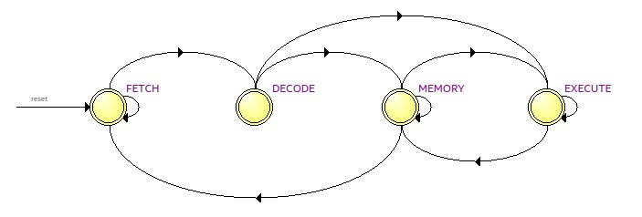

<h1 align="center">Coprocessador aritmético especializado em operações matriciais</h1>

<h2>Descrição do Projeto</h2>

  Para a elaboração do projeto, foi utilizado o kit de desenvolvimento DE1-SoC com o processador Cyclone V, permitindo a leitura e escrita de dados diretamente na memória RAM do dispositivo. O objetivo do programa é implementar um coprocessador dedicado ao processamento de matrizes quadradas, variando de 2x2 até 5x5, com o intuito de aliviar a carga do processador principal e, assim, aumentar o desempenho geral do sistema.As operações com matrizes são fundamentais no contexto computacional, pois estão presentes em diversas aplicações, como processamento de imagens, criptografia, telecomunicações, entre outras. Dessa forma, este repositório pode ser utilizado como base para projetos que envolvam esses tipos de aplicações. 

  O coprocessador é capaz de lidar com as seguintes operações:

  * Soma
  * Subtração
  * Multiplição
  * Multiplicação escalar
  * Determinante
  * Transposição de matriz
  * Matriz oposta

Sumário
=================
<!--ts-->
   * [Caminho de Dados](#caminho-de-dados)
   * [Arquitetura do Conjunto de Instruções](#instrucao)
   * [Máquina de Estados](#maquina-de-estados)
      * [FETCH](#fetch)
      * [DECODE](#decode)
      * [EXECUTE](#execute)
      * [MEMORY](#memory)
   * [Unidade Lógica e Aritmética (ULA)](#ula)
   * [Testes](#testes) 
   * [Resultados](#resultados)
   * [Referências](#referencias)
<!--te-->

  <h2>Caminho de Dados</h2>
  

    O caminho de dados é uma unidade funcional dentro de um processador que executa operações de processamento de dados usando componentes como unidades lógicas aritméticas, barramentos, multiplexadores e     registradores. É responsável por executar instruções e manipular dados no processador.

    
  

  

  <h2>Arquitetura do Conjunto de Instruções</h2>
   

    A ISA (Arquitetura do Conjunto de Instruções) define as instruções que o processador reconhece e executa, incluindo operações, tipos de dados e modos de endereçamento. Neste projeto, cada instrução         possui 28 bits, organizados respectivamente da seguinte maneira:
  

  <table border="1" align="center">
    <tr>
        <td>Número 0</td>
        <td>Número 1</td>
        <td>Identificador</td>
        <td>Linha</td>
        <td>Coluna</td>
        <td>Opcode</td>
    </tr>
    <tr>
      <td>8 bits</td>
      <td>8 bits</td>
      <td>2 bits</td>
      <td>3 bits</td>
      <td>3 bits</td>
      <td>4 bits</td>
    </tr>
  </table>
   

    O identificador indica ao coprocessador qual matriz está sendo utilizada na operação, conforme a tabela a seguir:
  

  <table border="1" align="center">
    <tr>
      <td>Matriz A</td>
      <td>Matriz B</td>
      <td>Matriz C</td>
    </tr>
    <tr>
      <td>00</td>
      <td>01</td>
      <td>10</td>
    </tr>
  </table>
  

    A linha e a coluna são utilizadas para identificar a posição específica da matriz que está sendo acessada durante a operação, conforme a tabela a seguir: 
  

  <table border="1" align="center">
    <tr>
      <td>Linha</td>
      <td>Coluna</td>
      <td>Posição da Matriz</td>
    </tr>
    <tr><td>000</td><td>000</td><td>[0][0]</td></tr>
    <tr><td>000</td><td>001</td><td>[0][1]</td></tr>
    <tr><td>000</td><td>010</td><td>[0][2]</td></tr>
    <tr><td>000</td><td>011</td><td>[0][3]</td></tr>
    <tr><td>000</td><td>100</td><td>[0][4]</td></tr>
  </table>

  <h2>Máquina de Estados</h2>
  Na arquitetura de uma unidade de processamento central (CPU) é utilizado o ciclo Fetch-Decode-Execute (FDE) para executar instruções, nesse modelo o processador tem três estados, busca, decodificação e execução, dessa forma foi utilizado esse modelo no projeto com a adição do estado MEMORY para lidar com todas operações feitas com a memória. 

   
  

  
   
  O módulo responsavel nesse desenvolvimento é o <code>top.v</code>
  

  <h2>Estado de FETCH</h2>
  
  

  <h2>Estado de DECODE</h2>
  
  

  <h2>Estado de EXECUTE</h2>
  
  

  

  <h2>Estado de MEMORY</h2>
  
  

  <h2>Unidade Lógica e Aritmética (ULA)</h2>
  

  O seu papel essencial é realizar diversas operações matemáticas e lógicas em dígitos binários, sendo os elementos básicos da informática. A ULA é crucial não só em cálculos simples, mas também nas decisões que acontecem dentro da unidade central de processamento. A ULA recebe do banco de registradores duas matrizes, opcode e um sinal de start, assim obviamente o opcode será qual operação será realizada. As instruções referente a operação são as seguintes: 
    <li>
      <code>0011</code> : Soma
    </li>
    <li>
      <code>0100</code> : Subtração
    </li>
    <li>
      <code>0101</code> : Multiplicação
    </li>
    <li>
      <code>0110</code> : Transposta
    </li>
    <li>
      <code>0111</code> : Oposta
    </li>
    <li>
      <code>1000</code> : Multiplicação escalar
    </li>
    <li>
      <code>1001</code> : Determinante 2x2
    </li>
    <li>
      <code>1010</code> : Determinante 3x3
    </li>
    <li>
      <code>1011</code> : Determinante 4x4
    </li>
    <li>
      <code>1100</code> : Determinante 5x5 
    </li>
  

   

  Como é possível analisar é necessário para operação de determinante distinguir o tamanho da matriz, pois para as outras operações é trabalhado considerando que sempre irá obter o tamanho máximo, de maneira que se for enviado uma matriz de tamanho menor que o máximo estimulado o resultado ainda sairá correto, no caso da determinante o resultado sairá como errado nesse cenário. 
  
    
  

